# Time-Standard Token - Mermaid Diagrams

**Source:** [time-standard-token-design.md](./time-standard-token-design.md)

All diagrams in Mermaid.js syntax for easy visualization and implementation.

---

## 1. Complete System Overview

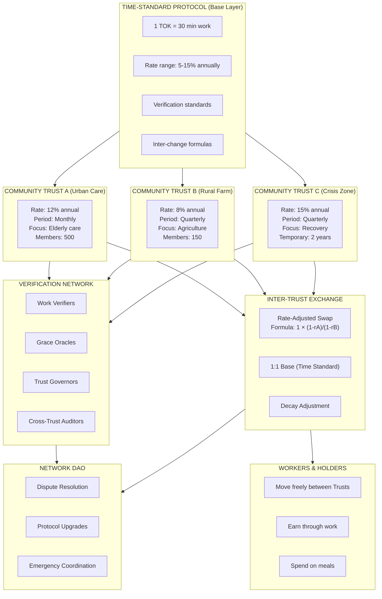

---

## 2. Input Side: Work-to-Token Flow

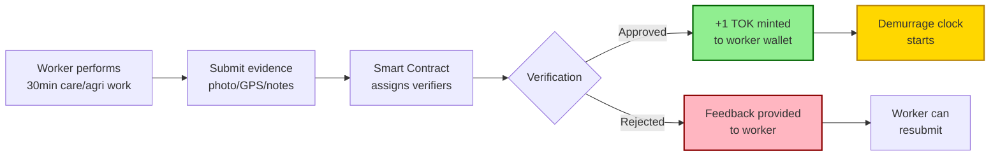

---

## 3. Output Side: Demurrage Decay Model

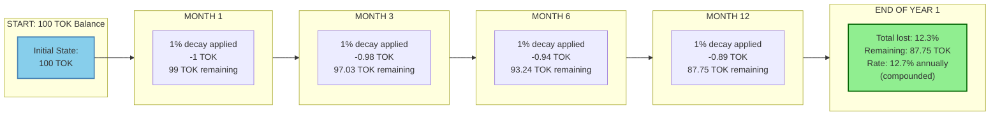

---

## 4. Comparison: Wrong vs Correct Demurrage Rates

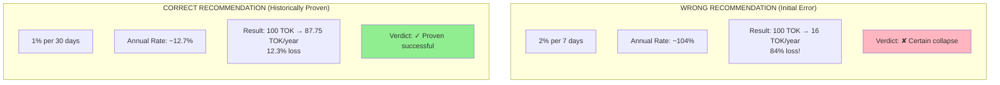

---

## 5. Community Trusts Network Architecture

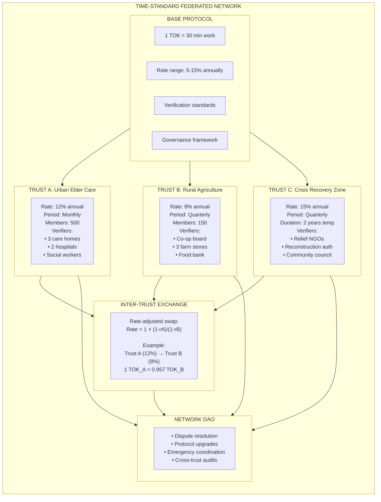

---

## 6. Verification Flow (Sequence Diagram)

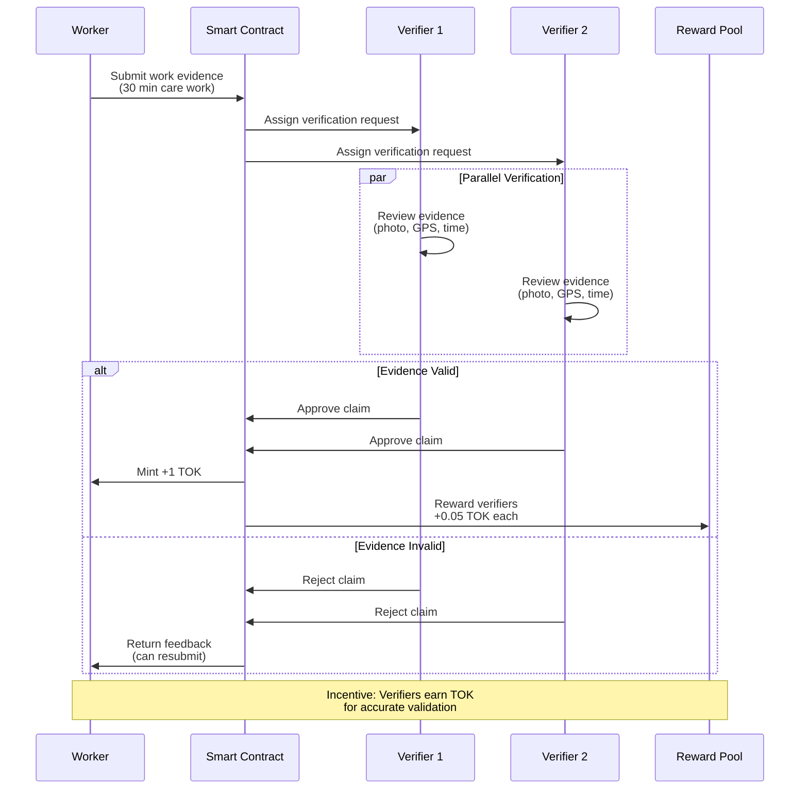

---

## 7. Grace Period State Diagram

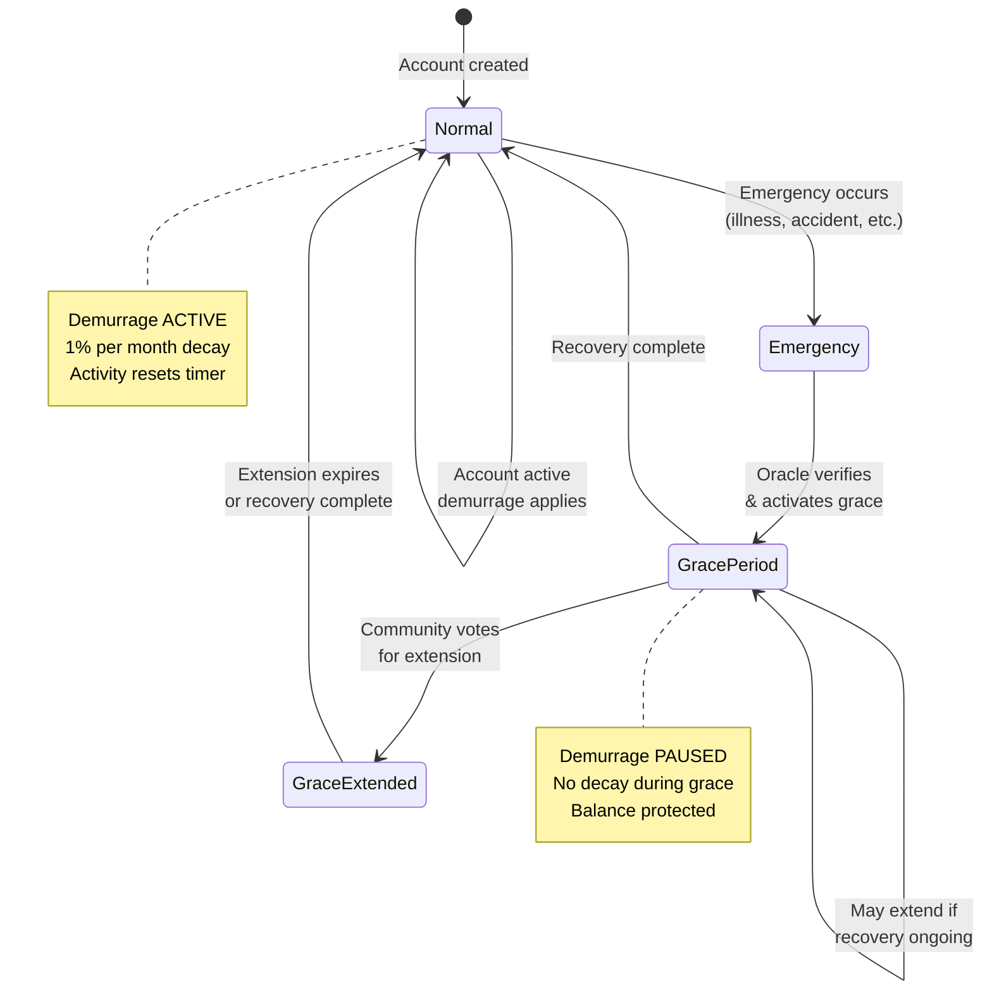

---

## 8. Grace Period Timeline

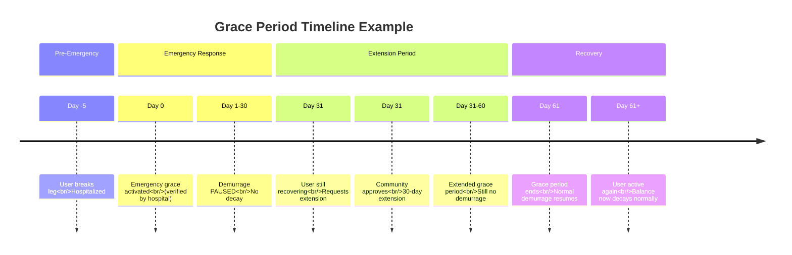

---

## 9. Governance Flow

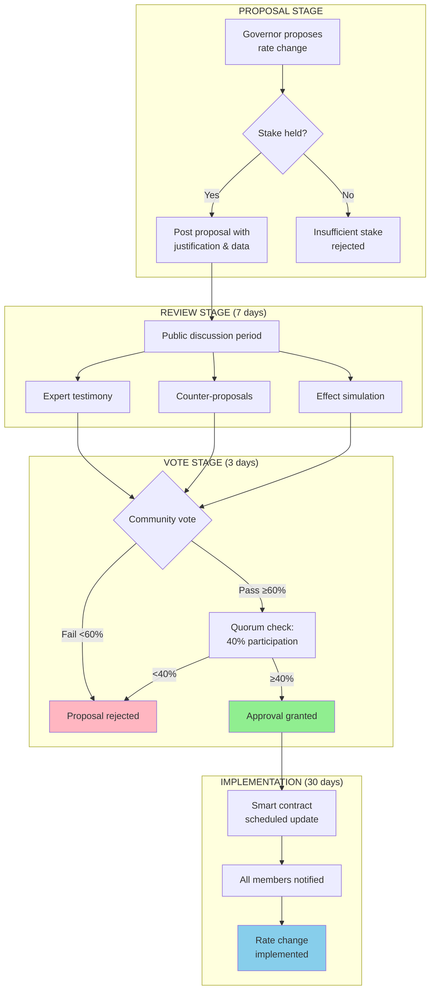

---

## 10. Cross-Trust Exchange Flow

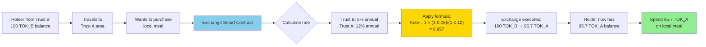

---

## 11. Trust Rate Decision Framework

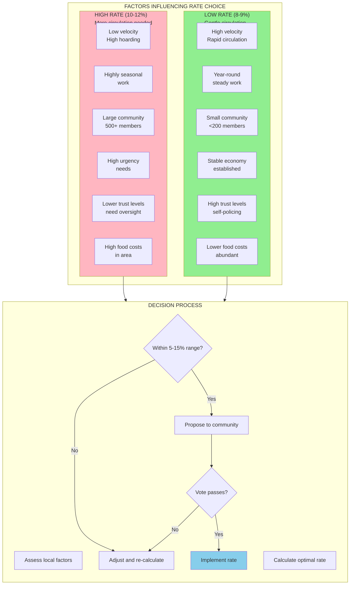

---

## 12. System Flow: Work to Meal

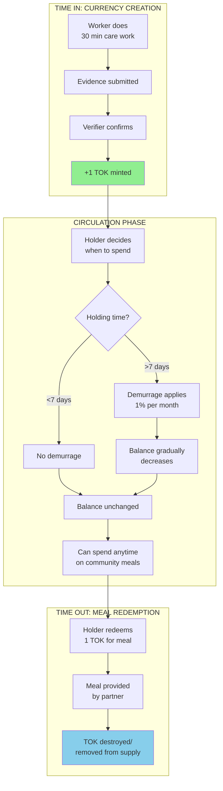

---

## 13. Protocol Constraints

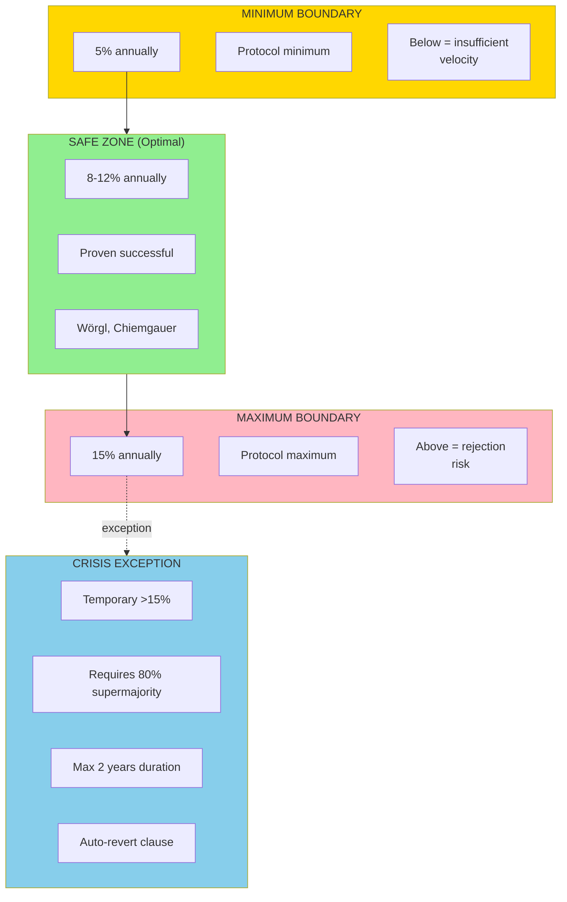

---

## 14. Verification Roles & Permissions

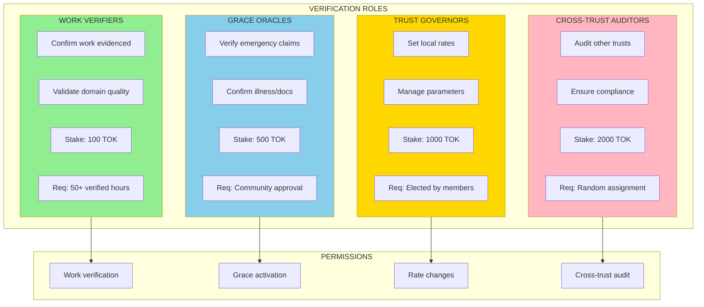

---

## 15. Implementation Roadmap

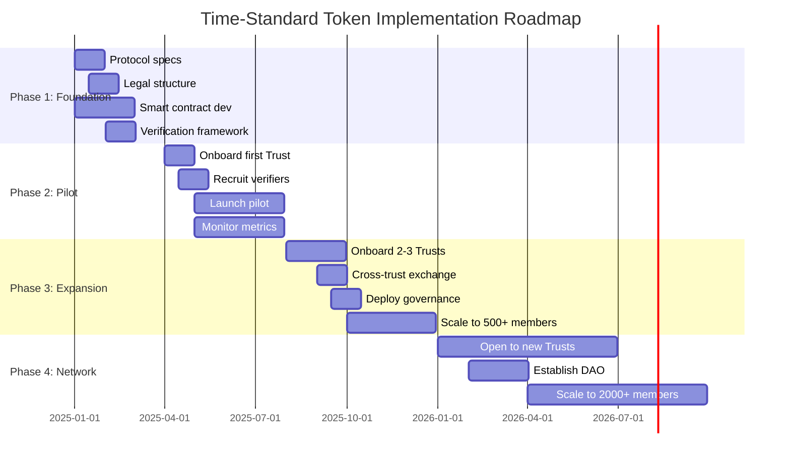

---

## 16. Anti-Fraud Measures

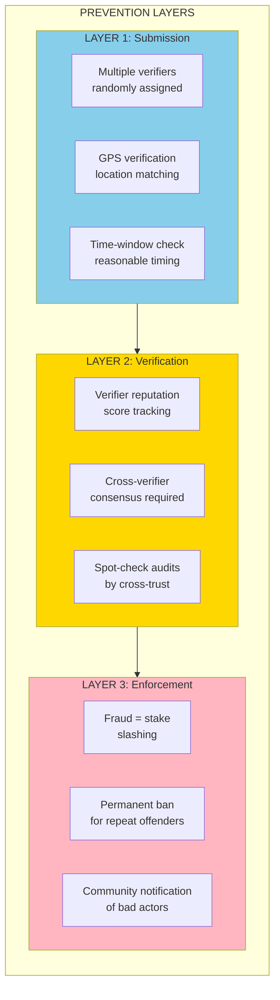

---

## 17. Economic Flow Diagram

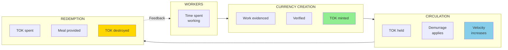

---

## 18. Trust Decision Tree

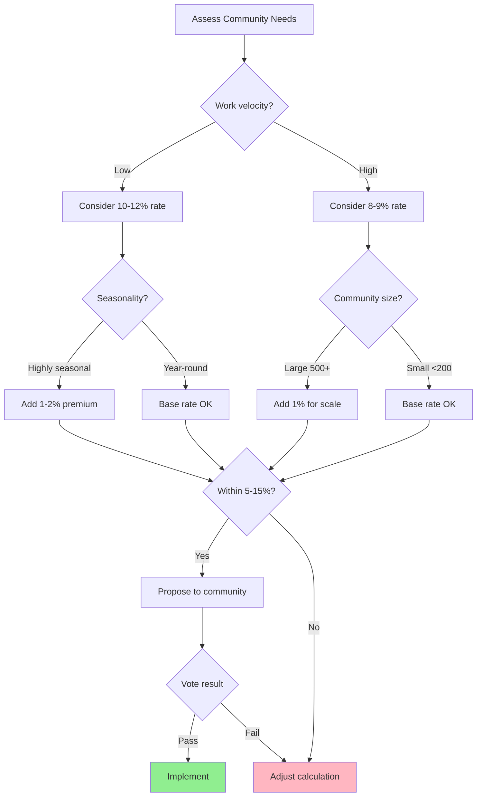

---

## Usage Instructions

### Viewing Diagrams

1. **Online**: Copy any diagram code and paste into [Mermaid Live Editor](https://mermaid.live)
2. **GitHub/GitLab**: Diagrams render automatically in markdown files
3. **VS Code**: Install Mermaid Preview extension
4. **Documentation**: Most modern documentation tools support Mermaid

### Editing Diagrams

- All diagrams use standard Mermaid.js syntax
- Modify text within brackets to update labels
- Adjust styling with `style` directives
- Test changes in Mermaid Live Editor before committing

### Export Options

- PNG/SVG: Export from Mermaid Live Editor
- PDF: Print from browser
- Code: Copy directly for integration

---

**Source Document:** [time-standard-token-design.md](./time-standard-token-design.md)
**Version:** 1.0
**Date:** 2025-01-01
