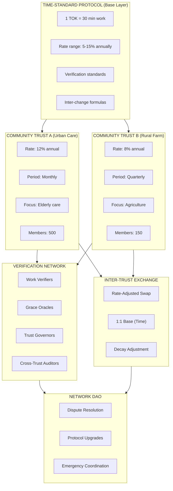
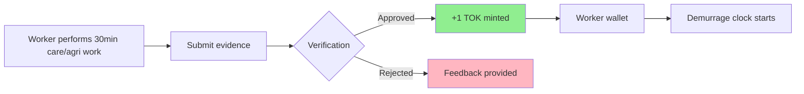
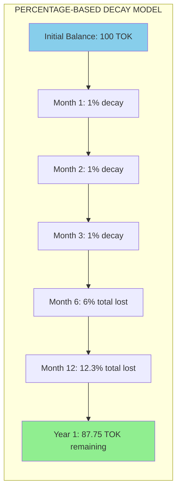
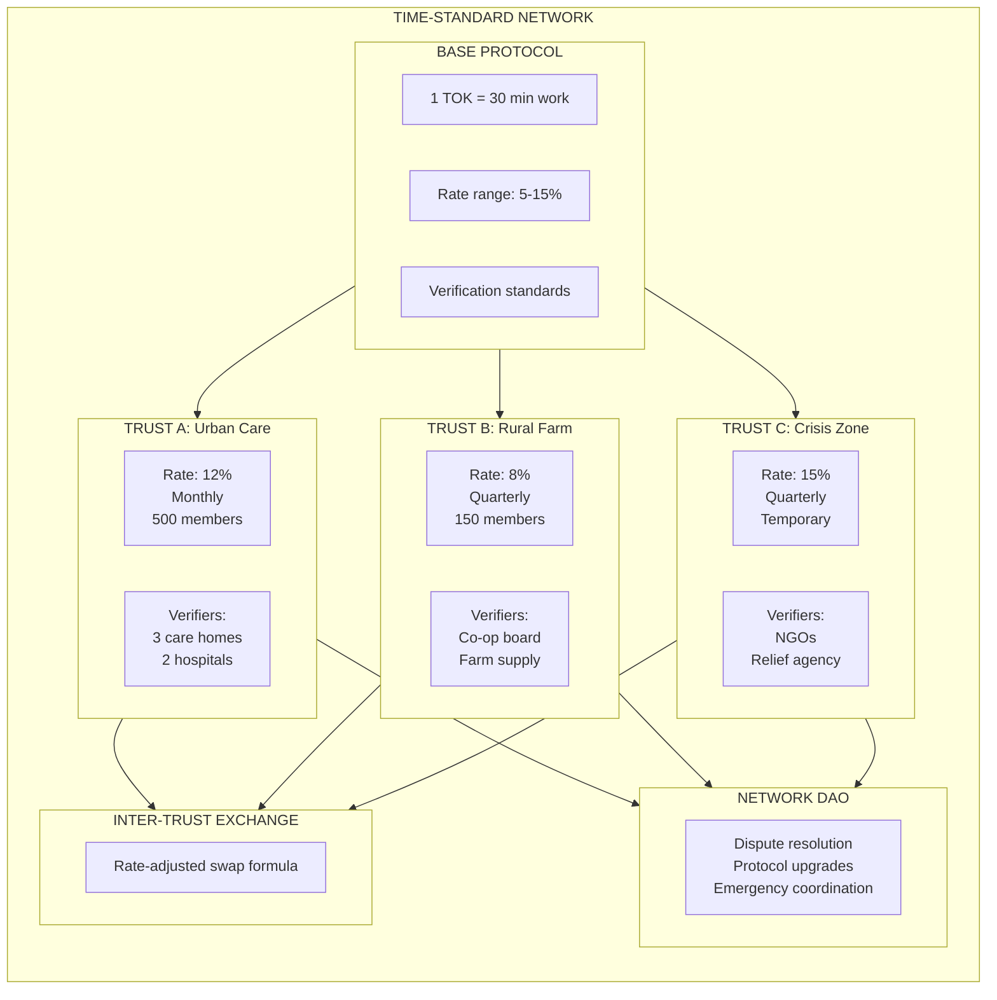
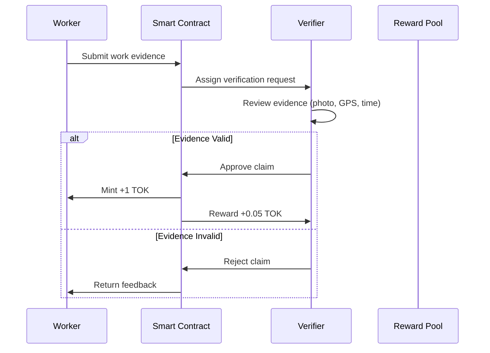
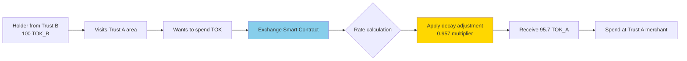
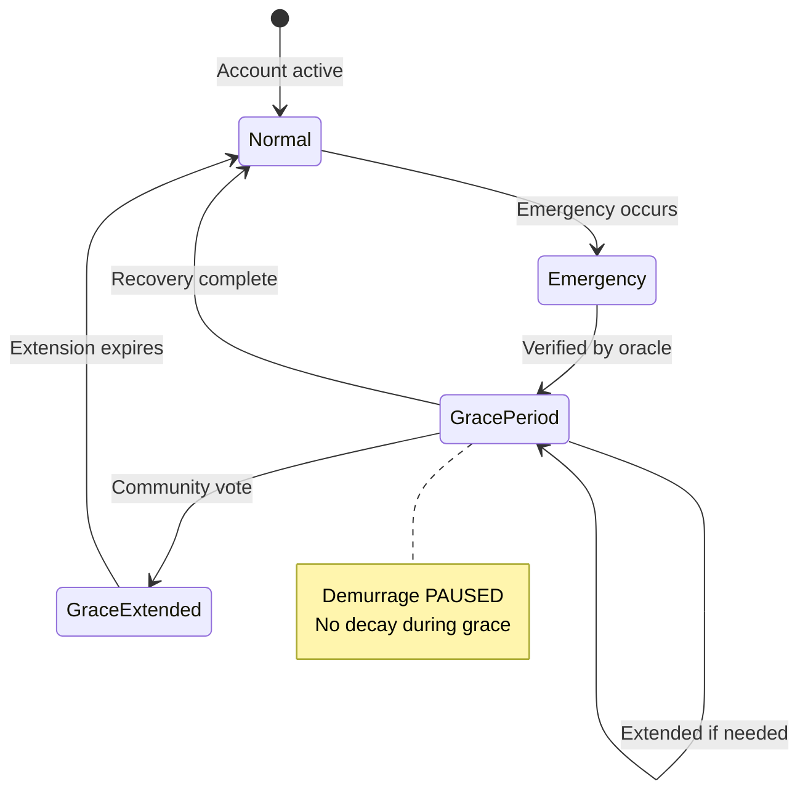
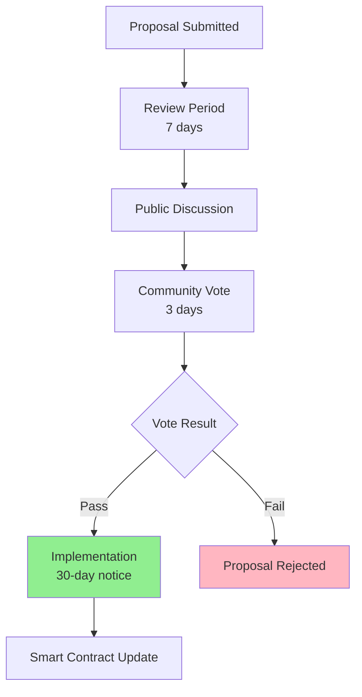

# Time-Standard Token (TOK): System Design Document

**Version:** 1.0
**Date:** 2025-01-01
**Status:** Design Phase

---

## Executive Summary

The Time-Standard Token is a community currency backed by **proven work time** in care and agriculture sectors, with a stable value peg to **1 community meal**.

### Core Equation

```
1 TOK = 30 minutes of evidenced care/agriculture work = 1 community meal
```

### Key Principles

1. **Time-Backed**: Every TOK represents measurable work (not speculative value)
2. **Meal-Pegged**: Stable exchange value through community meals
3. **Demurrage**: Time-based decay ensures circulation (8-12% annual rate)
4. **Federated**: Community Trusts set local parameters within protocol constraints
5. **Verified**: Decentralized network validates work and grace periods

---

## Table of Contents

1. [System Overview](#system-overview)
2. [Input Side: Currency Creation](#input-side-currency-creation)
3. [Output Side: Time-Based Demurrage](#output-side-time-based-demurrage)
4. [Federated Community Trusts](#federated-community-trusts)
5. [Verification Network](#verification-network)
6. [Inter-Trust Exchange](#inter-trust-exchange)
7. [Grace Periods](#grace-periods)
8. [Governance](#governance)
9. [Smart Contract Design](#smart-contract-design)
10. [Implementation Roadmap](#implementation-roadmap)

---

## System Overview

### Mermaid Diagram: Complete System Flow



### Key Metrics

| Metric | Value | Rationale |
|--------|-------|-----------|
| Base issuance | 2 TOK/hour | 1 TOK = 30 min (living wage basis) |
| Optimal demurrage | 8-12% annually | Historically proven (Wörgl, Chiemgauer) |
| Meal peg | 1 TOK = 1 meal | Stable, universally understood value |
| Velocity multiplier | 3-12x | Based on historical data |
| Trust rate range | 5-15% annually | Protocol-level constraints |

---

## Input Side: Currency Creation

### Mermaid Diagram: Work-to-Token Flow



### Issuance Rate Calculation

```
Base Rate Formula:
Rᵢ = (Pm × Wm) / Th

Where:
  Rᵢ = Token issuance rate (TOK/hour)
  Pm = Price of 1 meal (~$8 local reference)
  Wm = Living wage (~$16/hour)
  Th = Hours to produce 1 meal (~0.5 hours)

Result: Rᵢ = 2 TOK/hour
```

### Work-Type Multipliers

| Domain | Multiplier | TOK/Hour | Rationale |
|--------|-----------|----------|-----------|
| Basic care | 1.0× | 2.0 | Standard rate |
| Agricultural | 1.0× | 2.0 | Standard rate |
| Skilled care | 1.3× | 2.6 | Training/experience |
| Heavy labor | 1.3× | 2.6 | Physical intensity |
| Training/teaching | 1.5× | 3.0 | Knowledge transfer |
| Emergency care | 2.0× | 4.0 | Critical need |

---

## Output Side: Time-Based Demurrage

### Historical Context

| System | Annual Rate | Period | Velocity | Duration | Result |
|--------|-------------|--------|----------|----------|--------|
| Wörgl | 12.7% | Monthly | 12× | 13.5 mo | Banned by authorities |
| Chiemgauer | 8.2% | Quarterly | 3× | 20+ yrs | Ongoing success |
| **Optimal Range** | **8-12%** | - | **3-12×** | - | **Sweet spot** |
| 15%+ | Risk zone | - | - | Potential rejection |
| 50%+ | Collapse | - | - | Certain failure |

### Mermaid Diagram: Demurrage Decay Model



### Recommended Models

#### Option A: Monthly (Wörgl Model) ✓ RECOMMENDED

```
Rate: 1% per month
Annual: 12.7% (compounded)
Period: 30 days
Status: Proven successful
```

#### Option B: Quarterly (Chiemgauer Model)

```
Rate: 2% per quarter
Annual: 8.2% (compounded)
Period: 90 days
Status: 20+ years success
```

#### Option C: Weekly (Active Model)

```
Rate: 0.2% per week
Annual: 10.4% (compounded)
Period: 7 days
Status: Within optimal range
```

### Decay Table (Monthly 1%)

| Month | Calculation | Decay | Remaining | % Lost |
|-------|-------------|-------|-----------|--------|
| 0 | - | - | 100.00 | 0.0% |
| 1 | 100 × 0.01 | 1.00 | 99.00 | 1.0% |
| 3 | 98.01 × 0.01 | 0.98 | 97.03 | 3.0% |
| 6 | 94.18 × 0.01 | 0.94 | 93.24 | 6.8% |
| 12 | 88.64 × 0.01 | 0.89 | 87.75 | 12.3% |
| 24 | 78.47 × 0.01 | 0.78 | 77.70 | 22.3% |

---

## Federated Community Trusts

### Mermaid Diagram: Trust Network Architecture



### Trust Parameter Decision Framework

| Factor | High Rate Needed (10-12%) | Low Rate Acceptable (8-9%) |
|--------|---------------------------|----------------------------|
| Economic activity | Low velocity, high hoarding | High velocity, rapid circulation |
| Seasonality | Highly seasonal (agriculture) | Year-round steady work |
| Community size | Large (500+) | Small (<200) |
| Urgency | High (crisis areas) | Stable (established) |
| Trust levels | Low transaction trust | High trust, strong verification |
| Food costs | High meal costs | Low meal costs |

### Trust Profiles

#### Trust A: Urban Elder Care Network

```
Rate: 12% annually (1% monthly)
Period: Monthly
Members: 500
Verifiers: 3 care homes, 2 hospitals, social workers
Reasoning: High need for rapid care, many workers
```

#### Trust B: Rural Agricultural Cooperative

```
Rate: 8% annually (2% quarterly)
Period: Quarterly
Members: 150
Verifiers: Co-op board, 3 farm stores, food bank
Reasoning: Seasonal work, close-knit community
```

#### Trust C: Post-Disaster Recovery Zone

```
Rate: 15% annually (2.5% quarterly)
Period: Quarterly
Duration: 2 years temporary
Verifiers: Relief orgs, reconstruction authority, NGOs
Reasoning: Crisis requires maximum velocity
```

---

## Verification Network

### Mermaid Diagram: Verification Flow



### Verification Roles

| Role | Function | Stake Required |
|------|----------|---------------|
| **Work Verifiers** | Confirm work evidenced in domain | 100 TOK, 50+ verified hours |
| **Grace Oracles** | Verify emergency/illness claims | 500 TOK, community approval |
| **Trust Governors** | Set local rates, manage parameters | 1000 TOK, elected |
| **Cross-Trust Auditors** | Audit other trusts for compliance | 2000 TOK, random assignment |

### Anti-Cheat Measures

- Multiple verifiers randomly assigned per claim
- Verifier reputation score affects earnings
- Spot-check audits by cross-trust auditors
- Fraud = stake slashing + ban
- Geographic verification (GPS matching)
- Time-window verification (reasonable claim timing)

---

## Inter-Trust Exchange

### Exchange Rate Formula

```
Exchange Rate = 1 × (1 - r_A) / (1 - r_B)

Where:
  r_A = Annual decay rate of Trust A
  r_B = Annual decay rate of Trust B
```

### Example Calculation

```
Trust A (Urban):  12% annual decay
Trust B (Rural):   8% annual decay

Rate (A→B) = 1 × (1 - 0.12) / (1 - 0.08)
            = 1 × 0.88 / 0.92
            = 0.957

Result: 1 TOK_A = 0.957 TOK_B
```

### Mermaid Diagram: Cross-Trust Flow



---

## Grace Periods

### Grace Period Types

#### Type 1: Emergency Pause

```
Trigger: Verified emergency (medical, family, disaster)
Duration: 14-90 days based on severity
Effect: Demurrage completely paused
Verification: Community attestation or trusted oracle
```

#### Type 2: Illness/Injury Automatic

```
Trigger: Healthcare provider verification
Duration: 30 days + extensions as needed
Effect: Demurrage paused + optional TOK airdrop
Verification: DAO or healthcare oracle
```

#### Type 3: Community Voted Extensions

```
Trigger: Community DAO vote
Use: Long-term illness, family caregiving
Duration: 30-180 days (voted)
Threshold: 50% + 1 of voters
```

### Mermaid Diagram: Grace Period Flow



### Grace Period Timeline

```
Day -5:  User breaks leg, hospitalized
Day  0:  Emergency grace activated (verified by hospital)
Day  1-30: Demurrage PAUSED (no decay)
Day  31:  User still recovering, requests extension
Day  31-60: Extended grace period (community approved)
Day  61:  Grace ends, normal demurrage resumes
```

### Anti-Abuse Measures

- Maximum 3 grace periods per year per user
- Requires previous contribution history (50+ TOK earned)
- Random community spot-checks
- Oracle reputation tracking
- Fraud penalties (stake slashing)

---

## Governance

### Mermaid Diagram: Governance Flow



### Rate Change Protocol

#### Step 1: Proposal
- Any governor can propose rate change
- Must include justification, data, expected effects
- Requires 100 TOK stake (spam prevention)

#### Step 2: Review Period (7 days)
- Public discussion
- Counter-proposals allowed
- Expert testimony
- Simulation of effects

#### Step 3: Community Vote (3 days)
- One vote per verified human (not per TOK)
- Quorum: 40% participation required
- Threshold: 60% + 1 to pass
- Voting power proportional to contribution history

#### Step 4: Implementation (30-day notice)
- Smart contract automatic update
- All members notified
- Time to adjust holdings

### Protocol-Level Constraints

| Constraint | Value | Rationale |
|-----------|-------|-----------|
| Minimum Rate | 5% annually | Below = insufficient velocity |
| Maximum Rate | 15% annually | Above = historical failure zone |
| Min Adjustment | 1% point | Prevent micro-changes |
| Max Adjustment | 3% points | Prevent shocks |
| Min Period Between Changes | 90 days | Stability requirement |

### Crisis Exception

```
Temporary rate >15% allowed if:
- Network DAO approval
- 80% supermajority vote
- Time-limited (max 2 years)
- Automatic reversion clause
```

---

## Smart Contract Design

### Core Contract Structure

```solidity
// SPDX-License-Identifier: MIT
pragma solidity ^0.8.0;

/**
 * @title TimeStandardToken
 * @notice A community currency backed by evidenced work time
 * @dev 1 TOK = 30 minutes of care/agriculture work
 */
contract TimeStandardToken {

    // ────────────────────────────────────────────────────────────────
    // CORE CONSTANTS
    // ────────────────────────────────────────────────────────────────

    uint256 public constant MINUTES_PER_TOK = 30;
    uint256 public constant SECONDS_PER_TOK = 1800; // 30 minutes

    // Protocol-level rate constraints
    uint256 public constant MIN_ANNUAL_RATE = 500; // 5% in basis points
    uint256 public constant MAX_ANNUAL_RATE = 1500; // 15% in basis points

    // ────────────────────────────────────────────────────────────────
    // STATE VARIABLES
    // ────────────────────────────────────────────────────────────────

    struct Account {
        uint256 balance;
        uint256 lastActivity;
        uint256 gracePeriodEnd;
        uint256 contributionDays;
    }

    struct Trust {
        string name;
        uint256 annualRate; // Basis points (e.g., 1200 = 12%)
        uint256 demurragePeriod; // In seconds
        uint256 memberCount;
        bool isActive;
    }

    mapping(address => Account) public accounts;
    mapping(address => Trust) public trusts;
    mapping(address => bool) public verifiedWorkers;
    mapping(address => bool) public mealProviders;

    uint256 public totalSupply;
    uint256 public totalWorkSeconds;
    uint256 public treasuryBalance;

    // ────────────────────────────────────────────────────────────────
    // EVENTS
    // ────────────────────────────────────────────────────────────────

    event WorkClaimed(address indexed worker, uint256 minutes, uint256 tokEarned, uint256 timestamp);
    event DemurrageApplied(address indexed account, uint256 decayAmount, uint256 burned, uint256 toTreasury);
    event GraceActivated(address indexed user, uint256 days, uint256 timestamp);
    event MealRedeemed(address indexed provider, uint256 tokAmount);
    event TrustRateUpdated(address indexed trust, uint256 oldRate, uint256 newRate);

    // ────────────────────────────────────────────────────────────────
    // TIME INPUT: Claim Work for TOK
    // ────────────────────────────────────────────────────────────────

    /**
     * @notice Claim TOK for evidenced work
     * @param minutesWorked Minutes of care/agriculture work performed
     * @param evidenceProof Encrypted evidence hash (photo, GPS, etc.)
     */
    function claimWork(
        uint256 minutesWorked,
        bytes calldata evidenceProof
    ) public {
        require(verifiedWorkers[msg.sender], "Not verified worker");
        require(minutesWorked >= 15, "Minimum 15 minutes");

        // Calculate TOK: every 30 minutes = 1 TOK
        uint256 tokEarned = (minutesWorked * 1e18) / MINUTES_PER_TOK;

        // Update account
        accounts[msg.sender].balance += tokEarned;
        accounts[msg.sender].lastActivity = block.timestamp;
        accounts[msg.sender].contributionDays += (minutesWorked / 480); // 8hr day

        // Update global state
        totalSupply += tokEarned;
        totalWorkSeconds += (minutesWorked * 60);

        emit WorkClaimed(msg.sender, minutesWorked, tokEarned, block.timestamp);
    }

    // ────────────────────────────────────────────────────────────────
    // TIME OUTPUT: Apply Demurrage
    // ────────────────────────────────────────────────────────────────

    /**
     * @notice Calculate and apply demurrage for an account
     * @param account Address to calculate demurrage for
     * @return decayAmount Total TOK decayed
     */
    function applyDemurrage(address account) public returns (uint256) {
        Account storage acc = accounts[account];

        if (acc.balance == 0) return 0;

        // Skip if in grace period
        if (block.timestamp < acc.gracePeriodEnd) return 0;

        // Get trust-specific rate
        uint256 inactiveDays = (block.timestamp - acc.lastActivity) / 1 days;

        // Get trust for this user (simplified - would be tracked separately)
        uint256 annualRateBasisPoints = 1200; // Default 12%, would fetch from trust

        // Calculate decay based on days inactive and annual rate
        // Formula: B_new = B_old × (1 - r)^n
        // Where r = annual rate / (365 / period_days)

        uint256 decayRateBasisPoints = (annualRateBasisPoints * inactiveDays) / 365;
        uint256 decayAmount = (acc.balance * decayRateBasisPoints) / 10000;

        // Apply decay
        acc.balance -= decayAmount;

        // Split: 50% burned, 50% to treasury
        uint256 toTreasury = decayAmount / 2;
        uint256 burned = decayAmount - toTreasury;

        totalSupply -= burned;
        treasuryBalance += toTreasury;

        emit DemurrageApplied(account, decayAmount, burned, toTreasury);

        return decayAmount;
    }

    // ────────────────────────────────────────────────────────────────
    // GRACE PERIOD: Emergency Protection
    // ────────────────────────────────────────────────────────────────

    mapping(address => bool) public trustedOracles;
    mapping(address => uint256) public graceUsageCount; // Yearly tracking

    /**
     * @notice Activate grace period for user
     * @param user User address
     * @param daysDuration Duration in days
     */
    function activateGracePeriod(
        address user,
        uint256 daysDuration
    ) public {
        require(trustedOracles[msg.sender], "Not a trusted oracle");
        require(daysDuration <= 90, "Max 90 days");
        require(
            accounts[user].contributionDays >= 30,
            "Must have contributed 30+ days"
        );

        // Check grace period usage (max 3 per year)
        uint256 currentYear = block.timestamp / 365 days;
        require(graceUsageCount[user] < 3, "Max grace periods reached");

        accounts[user].gracePeriodEnd = block.timestamp + (daysDuration * 1 days);
        graceUsageCount[user]++;

        emit GraceActivated(user, daysDuration, block.timestamp);
    }

    // ────────────────────────────────────────────────────────────────
    // REDEMPTION: TOK for Meal
    // ────────────────────────────────────────────────────────────────

    /**
     * @notice Redeem TOK for community meal
     * @param tokAmount Amount of TOK to redeem
     */
    function redeemForMeal(uint256 tokAmount) public {
        require(mealProviders[msg.sender], "Not a meal provider");
        require(accounts[msg.sender].balance >= tokAmount, "Insufficient balance");

        // Apply any pending demurrage first
        applyDemurrage(msg.sender);

        // Burn TOK
        accounts[msg.sender].balance -= tokAmount;
        totalSupply -= tokAmount;

        // Update activity
        accounts[msg.sender].lastActivity = block.timestamp;

        emit MealRedeemed(msg.sender, tokAmount);
    }

    // ────────────────────────────────────────────────────────────────
    // TRUST MANAGEMENT
    // ────────────────────────────────────────────────────────────────

    /**
     * @notice Update trust's annual demurrage rate
     * @param newAnnualRateBasisPoints New rate in basis points
     */
    function updateTrustRate(uint256 newAnnualRateBasisPoints) public {
        require(
            newAnnualRateBasisPoints >= MIN_ANNUAL_RATE &&
            newAnnualRateBasisPoints <= MAX_ANNUAL_RATE,
            "Rate outside protocol bounds"
        );

        // In full implementation, would include governance voting logic

        uint256 oldRate = trusts[msg.sender].annualRate;
        trusts[msg.sender].annualRate = newAnnualRateBasisPoints;

        emit TrustRateUpdated(msg.sender, oldRate, newAnnualRateBasisPoints);
    }

    // ────────────────────────────────────────────────────────────────
    // CROSS-TRUST EXCHANGE
    // ────────────────────────────────────────────────────────────────

    /**
     * @notice Calculate exchange rate between two trusts
     * @param sourceTrust Source trust address
     * @param destTrust Destination trust address
     * @return exchangeRate Exchange rate as 1e18 multiplier
     */
    function calculateExchangeRate(
        address sourceTrust,
        address destTrust
    ) public view returns (uint256) {
        uint256 rateSource = trusts[sourceTrust].annualRate;
        uint256 rateDest = trusts[destTrust].annualRate;

        // Rate adjustment formula
        uint256 exchangeRate = (1e18 * (10000 - rateSource)) / (10000 - rateDest);

        return exchangeRate;
    }

    /**
     * @notice Swap TOK between trusts with rate adjustment
     * @param amount Amount to swap
     * @param sourceTrust Source trust
     * @param destTrust Destination trust
     */
    function crossTrustSwap(
        uint256 amount,
        address sourceTrust,
        address destTrust
    ) public returns (uint256) {
        uint256 exchangeRate = calculateExchangeRate(sourceTrust, destTrust);
        uint256 received = (amount * exchangeRate) / 1e18;

        // Transfer logic (simplified)
        accounts[msg.sender].balance -= amount;
        accounts[msg.sender].balance += received;

        return received;
    }
}
```

---

## Implementation Roadmap

### Phase 1: Foundation (Months 1-3)

- [ ] Finalize protocol specifications
- [ ] Establish legal structure for Network DAO
- [ ] Develop smart contract test suite
- [ ] Create verification framework
- [ ] Design governance system

### Phase 2: Pilot Trust (Months 4-6)

- [ ] Onboard first Community Trust (recommend: Urban Care)
- [ ] Recruit initial verifiers (5-10)
- [ ] Launch with 50-100 initial members
- [ ] Establish meal provider partnerships (3-5)
- [ ] Monitor velocity and circulation metrics

### Phase 3: Expansion (Months 7-12)

- [ ] Onboard 2-3 additional Community Trusts
- [ ] Implement cross-trust exchange
- [ ] Deploy governance system
- [ ] Scale to 500+ total members
- [ ] Optimize based on pilot data

### Phase 4: Network Growth (Year 2)

- [ ] Open protocol to new Trusts
- [ ] Establish Network DAO
- [ ] Implement cross-trust audits
- [ ] Scale to 2,000+ members
- [ ] Develop mobile applications

### Phase 5: Maturity (Year 3+)

- [ ] Protocol-level stability
- [ ] 10,000+ members across 20+ Trusts
- [ ] Established meal provider network
- [ ] Proven economic impact data
- [ ] Potential for regional expansion

---

## Key Success Metrics

| Metric | Target | Measurement |
|--------|--------|-------------|
| Velocity | 3-12x | Transaction volume / supply |
| Active users | 60%+ monthly | DAU / MAU ratio |
| Meal redemptions | 80%+ of TOK | TOK redeemed / earned |
| Trust sustainability | 100% | No trust failures |
| Demurrage effectiveness | 10%+ circulation avg | % of supply circulating weekly |

---

## Risk Mitigation

| Risk | Mitigation |
|------|------------|
| Rate too high (collapse) | Protocol caps at 15%, governance approval |
| Rate too low (stagnation) | Protocol minimum at 5%, network DAO intervention |
| Verification fraud | Reputation system, stake slashing, cross-trust audits |
| Meal peg instability | Treasury reserve, provider agreements, dynamic adjustment |
| Trust isolation | Inter-trust exchange, network-wide standards |
| Grace period abuse | Usage limits, verification requirements, spot-checks |

---

## References

1. **Wörgl Experiment (1932-1933)** - 1% monthly demurrage, 12× velocity
2. **Chiemgauer (2003-present)** - 2% quarterly demurrage, 3× velocity, 20+ years
3. **Silvio Gesell's "The Natural Economic Order"** - Original demurrage theory
4. **Time Banking literature** - Community time exchange systems
5. **Blockchain demurrage experiments** - Freicoin, Encointer, Circles UBI

---

## Conclusion

The Time-Standard Token represents a synthesis of:

1. **Historical success** - Proven demurrage rates (8-12% annually)
2. **Modern technology** - Blockchain smart contracts
3. **Community focus** - Federated Trusts with local autonomy
4. **Fair value** - Time-backing with meal peg
5. **Resilience** - Decentralized verification network

The system is designed to:
- ✓ Encourage circulation through demurrage
- ✓ Maintain stable value through meal peg
- ✓ Empower communities through federated governance
- ✓ Prevent abuse through verification and reputation
- ✓ Scale sustainably through protocol constraints

---

**Document Version:** 1.0
**Last Updated:** 2025-01-01
**Next Review:** Upon pilot completion
